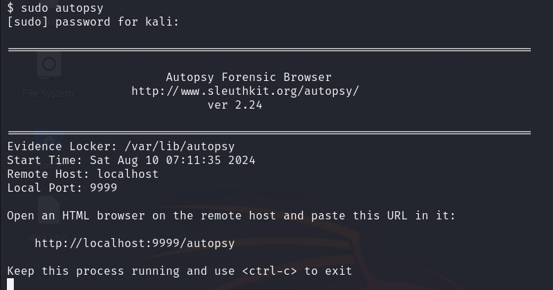
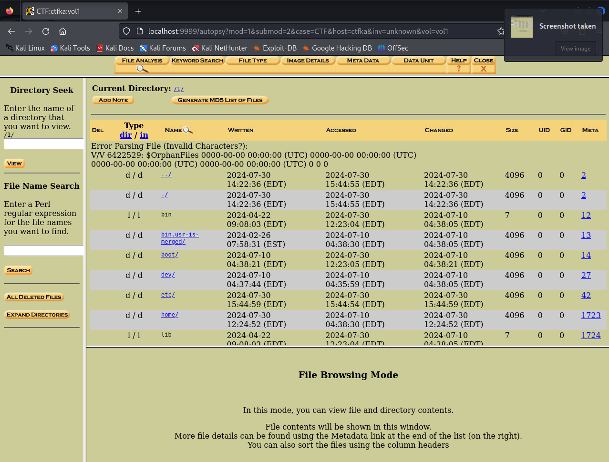
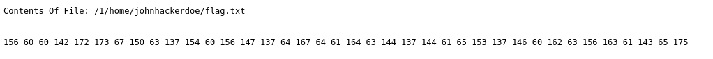
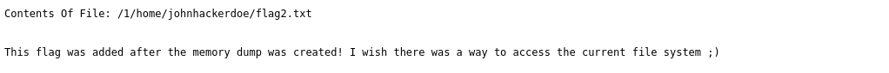
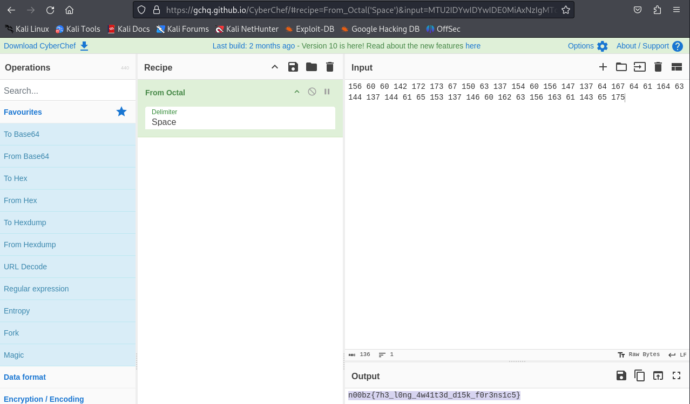

# Forensic - Disk Golf (457 points)
## Writeup Author - slzzpp

---
### Task
Let's play some disk golf!

Attached files: [disk.img.tar.gz](assets/disk_golf/disk.img.tar.gz)

---
### Solution
And so, we have an image of a hard disk in front of us, we will use the autopsy utility to view its contents.
1) Run the utility with the command `sudo autopsy` and go to the browser at `http://localhost:9999/autopsy`.


2) Next, import this hard disk image.


3) By looking at the home directory of the user `johnhackerdoe`, you can notice interesting files `flag.txt ` and `flag2.txt `:


4) Next, all that remains is to get our flag using the [CyberChef](https://gchq.github.io/CyberChef/#recipe=From_Octal('Space')&input=MTU2IDYwIDYwIDE0MiAxNzIgMTczIDY3IDE1MCA2MyAxMzcgMTU0IDYwIDE1NiAxNDcgMTM3IDY0IDE2NyA2NCA2MSAxNjQgNjMgMTQ0IDEzNyAxNDQgNjEgNjUgMTUzIDEzNyAxNDYgNjAgMTYyIDYzIDE1NiAxNjMgNjEgMTQzIDY1IDE3NQ) service.

---
### Flag

```
n00bz{7h3_l0ng_4w41t3d_d15k_f0r3ns1c5}
```
