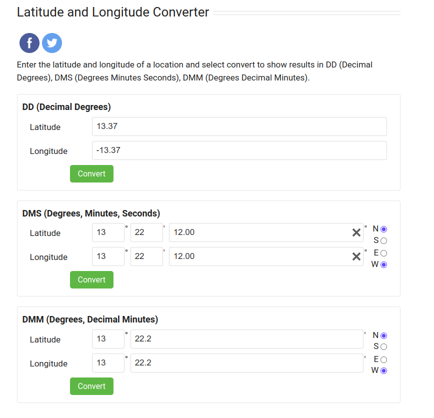

# Forensic - Plane (100 points)
## Writeup Author - slzzpp

---
### Task
So many plane-related challenges! Why not another one? The flag is the latitude, longitude of the place this picture is taken from, rounded upto two decimal places. Example: n00bz{55.51,-20.27}.

Attached files: [plane.jpg](assets/plane/plane.jpg)

---
### Solution
1) In order to find the flag, you need to look at the metadata of this photo and we can easily find the coordinates:


2) Well, then you can use any service to convert the latitude and longitude to a decimal value:


---
### Flag

```
n00bz{13.37,-13.37}
```
