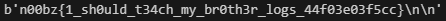

# Substraction (448 points)
## Writeup Author - GameIsOn

---

### Task

My little brother is learning math, can you show him how to do some subtraction problems?

Attached files:
[server.py](./assets/server.py)

---

### Solution

The server is sending us 696969 even numbers, ranging from 0 to 696968 included. Our task is, using substraction and modulus, transform them all to the same number.

Let's do an example with two numbers:
```
167534 132564
```
If we want them to be equal, we need to substract the minimum of them from both, to get one to zero, and, after that, substract half of the remained number.

```
  167354 | 132564
-         
  132564 | 132564
=================
  34790  | 0
- (abs)      
  17395  | 17395
=================
  17395  | 17395
```
Looking at the count of around 300000 numbers and only 20 substractions, we need to do that for several numbers at once. The most efficient method is to get the same numbers for half of all the provided numbers. Thus, the best is to grab the maximum and the minimum from the list and do the same method 20 times.

Script turned out like this:
```Python
  # x - provided list from the connection

  x = list(set(x))
  x.sort()
  for _ in range(20):
    maxim = x[-1]
    min = x[0]
    adding = abs(maxim - min) // 2 + min
    print(adding)
    for i in range(len(x)):
      x[i] = abs(x[i] - adding)
    x = list(set(x))
    x.sort()
```

After connecting it to the socket and running the script, we get the flag.



---

### Flag

```
n00bz{1_sh0uld_t34ch_my_br0th3r_logs_44f03e03f5cc}
```
