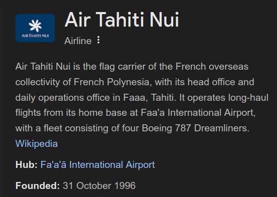

# Tail (100 points)
## Writeup Author - h1tok1r11

---

### Task

Here's a picture of a plane's tail. Can you find the airline's hub (the airport where they mostly operate from). Use the three letter airport IATA code and wrap it in n00bz{}. Example: n00bz{SFO}. Author: NoobMaster

Attached files:
[tail.jpg](./assets/tail.jpg)

---

### Solution

The first thing that comes to mind is to use a photo search. I tried to use Google's "Search by image" but I didn't find anything interesting. So I decided to search by photo in Yandex. Now we can see something helpful for us:


Google "Air Tahiti Nui":



In the logo we see a flower, so this is probably what we need.

Find the IATA code of hub (Fa'a'ā International Airport): PPT

### Flag

```
n00bz{PPT}
```
