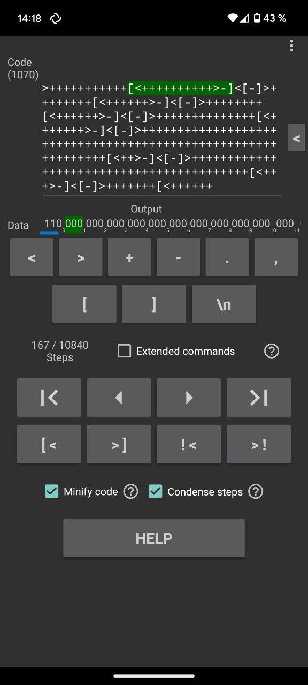

# Rev - Brain (343 points)
## Writeup Author - Gluk0zka

---

### Task
Help! A hacker said that this "language" has a flag but I can't find it! Author: NoobMaster

Attached files:


---

### Solution

Here is a code for brainfack, trying to understand how to solve the problem I came across a [debugger and an interpreter](https://play.google.com/store/apps/details?id=com.BrainfuckInterpreter.BrainfuckInterpreter&hl=en_US&pli=1) for android for it


We enter our code and click on the arrow. 
In the Date field, the ASCI codes will be shown. 
Since we know that the flag starts with n, we will look for code 110.
Each press executes the next instruction


After the first click we see 001, but this is not what we need, so we move on


And finally we found what we were looking for. 
It follows that the necessary codes will always appear in cell 0. 
We continue to execute the instructions until we get the entire flag.





---
### Flag

```
n00bz{1_c4n_c0d3_1n_br41nf*ck!}
```
